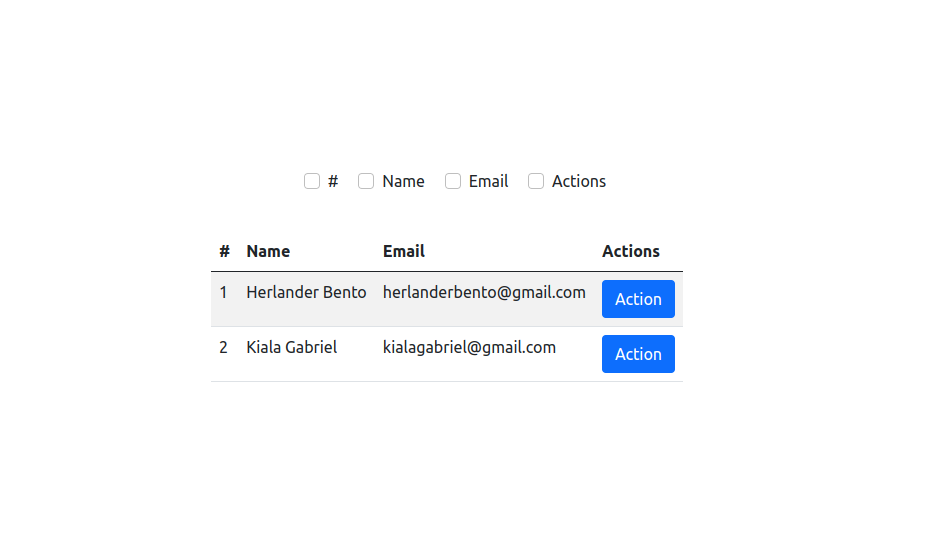
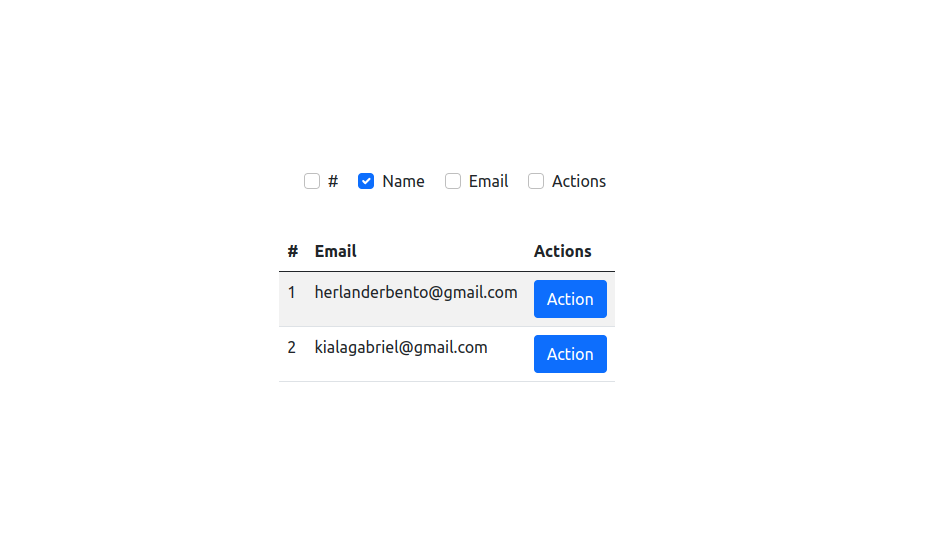

# Hide column from table

Hide column of table when check at column name.

Example: ✍️

When click on checkbox with column name will hide the column with checked name.

Look this:🤔🤔

## Credits

Credits for me `António Gabriel`
